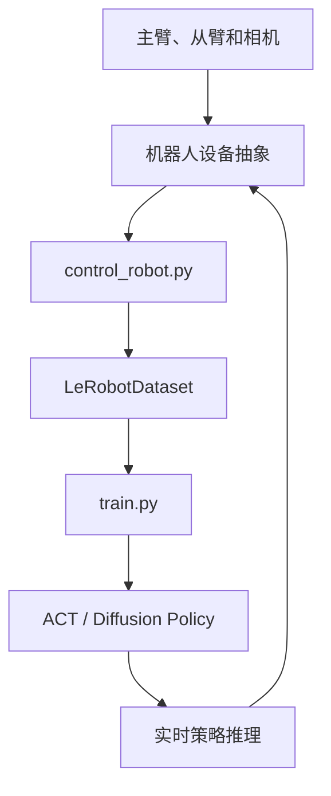
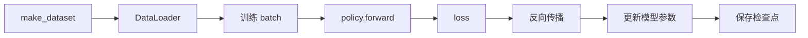

# LeRobot 框架学习笔记

## 学习日期

2026-07-18（30 天计划第 2 天）

## 今日目标

- 了解 LeRobot 的设备、数据集、策略、训练和推理结构；
- 理解 `teleoperate`、`record`、`replay` 与策略推理的区别；
- 能说明一条示教数据如何进入数据集并用于训练。

## 一、整体架构



LeRobot 将机器人硬件、数据和学习算法分开：

- 机器人层负责连接设备、读取观测和执行动作；
- 控制层负责标定、遥操作、录制和回放；
- 数据集层负责保存图像、关节状态、动作及任务；
- 策略层负责根据观测预测动作；
- 训练层负责从示教数据优化策略参数。

## 二、机器人设备抽象

统一接口位于 `lerobot/common/robot_devices/robots/utils.py`，三个关键方法是：

```python
observation, action = robot.teleop_step(record_data=True)
observation = robot.capture_observation()
executed_action = robot.send_action(predicted_action)
```

### `teleop_step()`

读取主臂关节位置，转换为从臂目标动作并发送给从臂。开启 `record_data=True` 后，同时返回观测和动作，供示教数据录制。

### `capture_observation()`

只读取当前状态，不产生动作。观测通常包括关节状态和一个或多个相机图像，是策略模型的输入。

### `send_action()`

将动作发送给从臂。返回值可能是经过安全限幅后的实际动作，因此录制评估数据时应保存实际执行动作。

## 三、`control_robot.py` 的职责

`control_robot.py` 是真机控制总入口。它先通过配置创建机器人，再按照控制配置分派到不同模式：

```text
calibrate  → 标定零位和关节范围
teleoperate → 人控制主臂，从臂跟随
record      → 录制观测、动作和任务信息
replay      → 逐帧重放已有动作
```

可以把它理解为控制模式路由器，而不是训练模型的入口。

## 四、四种运行方式的区别

| 模式 | 动作来源 | 使用实时观测 | 保存数据 | 主要用途 |
| --- | --- | --- | --- | --- |
| `calibrate` | 标定过程 | 部分 | 否 | 建立零位和活动范围 |
| `teleoperate` | 操作者移动主臂 | 是 | 默认否 | 检查设备和主从跟随 |
| `record` | 操作者或已训练策略 | 是 | 是 | 生成示教或评估数据 |
| `replay` | 数据集中已有动作 | 否 | 否 | 原样复现历史轨迹 |
| 策略推理 | ACT/Diffusion 模型 | 是 | 可选 | 根据当前场景自动控制 |

`replay` 属于开环复现：它不根据当前图像修正动作。策略推理属于闭环控制：每轮都会读取最新观测，再预测动作。

## 五、录制一帧数据

无策略录制时，控制循环调用：

```python
observation, action = robot.teleop_step(record_data=True)
frame = {**observation, **action, "task": single_task}
dataset.add_frame(frame)
```

一帧通常包含：

```python
{
    "observation.state": [...],
    "observation.images.main": image,
    "action": [...],
    "task": "抓取枯枝并放入收集框",
}
```

- frame：某个时间点的观测和动作；
- episode：从任务开始到结束的一段连续帧；
- dataset：多个 episode 的集合。

完成一个 episode 后调用 `dataset.save_episode()`。

## 六、数据集工厂

训练入口通过 `make_dataset(cfg)` 创建数据集。数据集工厂负责：

1. 根据 `repo_id` 定位数据集；
2. 读取相机、状态、动作、帧率和统计量等元信息；
3. 根据策略需要建立时间窗口；
4. 配置图像变换；
5. 返回可供 PyTorch DataLoader 使用的数据集。

ACT 或 Diffusion Policy 可能使用过去若干帧观测并预测未来一段动作，因此训练样本不一定只对应单帧。

## 七、策略工厂

策略工厂根据 `cfg.type` 创建具体模型：

```text
act       → ACTPolicy
diffusion → DiffusionPolicy
pi0       → PI0Policy
vqbet     → VQBeTPolicy
tdmpc     → TDMPCPolicy
```

典型调用：

```python
policy = make_policy(
    cfg=cfg.policy,
    ds_meta=dataset.meta,
)
```

`dataset.meta` 用于确定图像输入、状态维度、动作维度以及归一化统计量。由于模型通过统一工厂创建，ACT 与 Diffusion 可以复用同一个训练入口。

## 八、训练流程



核心过程可简化为：

```python
dataset = make_dataset(cfg)
policy = make_policy(cfg.policy, ds_meta=dataset.meta)

for batch in dataloader:
    loss, output = policy.forward(batch)
    loss.backward()
    optimizer.step()
    optimizer.zero_grad()
```

模型学习的目标是：根据相机图像和机器人状态预测接近示教动作的输出。

## 九、策略推理

```python
observation = robot.capture_observation()
predicted_action = policy.select_action(observation)
executed_action = robot.send_action(predicted_action)
```

闭环数据流为：

```text
最新图像和关节状态
        ↓
policy.select_action()
        ↓
预测动作并进行安全限幅
        ↓
robot.send_action()
        ↓
机械臂运动后重新获取观测
```

## 十、一条示教数据的完整路径

```text
操作者移动主臂
    ↓
teleop_step() 控制从臂
    ↓
获得 observation 和实际 action
    ↓
dataset.add_frame()
    ↓
dataset.save_episode()
    ↓
DataLoader 组成训练 batch
    ↓
ACT / Diffusion 计算 loss
    ↓
反向传播并保存模型
    ↓
真机上 capture_observation()
    ↓
policy.select_action()
    ↓
send_action() 驱动机械臂
```

## 今日结论

LeRobot 的核心思想是用统一接口隔离硬件与算法。示教阶段由人产生动作并同时记录观测；训练阶段学习“观测到动作”的映射；部署阶段模型取代操作者，根据实时观测持续生成动作。

## 自测结果

- `teleoperate` 与 `record`：前者只控制，后者还保存数据；
- 实际动作与预测动作：安全裁剪后实际发送的动作才是真实执行值；
- `replay` 与推理：前者重放历史动作，后者根据最新观测产生新动作；
- `dataset.meta`：向模型提供字段、维度和归一化统计量；
- frame 与 episode：frame 是一个时间点，episode 是一次完整任务；
- 推理三个核心调用：`capture_observation()`、`select_action()`、`send_action()`。
