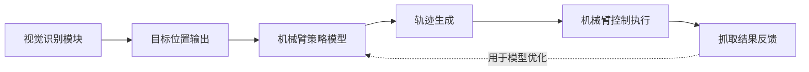
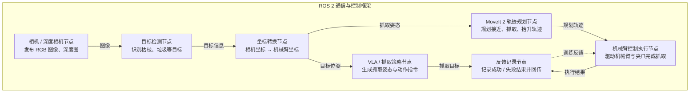
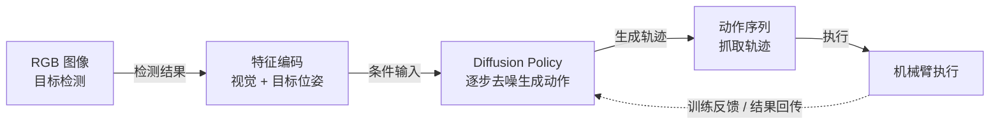

# 机械臂训练与学习模块实施方案

## 一、模块目标补充

本模块重点实现：机器人在识别到枯枝、垃圾等目标后，能够自主完成抓取与放置操作，即形成“识别 → 定位 → 抓取 → 放置”的闭环能力。

## 二、系统结构图



数据流说明：

1. 语义识别模块输出目标类别与坐标。
2. VLA 模型根据目标信息生成抓取动作。
3. 控制模块执行机械臂轨迹。
4. 成功/失败结果反馈用于模型优化。

## 三、核心实现步骤

1. 接收视觉模块输出的目标位置（ROS 2 Topic）。
2. 将目标坐标转换为机械臂坐标系（手眼标定）。
3. 输入 VLA 模型生成抓取策略。
4. 规划机械臂轨迹（MoveIt 2）。
5. 执行抓取动作（闭合夹爪）。
6. 将物体放入指定区域。
7. 记录执行结果用于后续训练优化。

## 四、关键代码示例（抓取流程）

```python
# 接收目标位置
target = get_target_from_ros()

# 坐标转换
grasp_pose = transform_to_robot_frame(target)

# 生成动作
action = model.predict(grasp_pose)

# 执行轨迹
robot.move_to(action["position"])
robot.gripper.close()
```

## 五、系统结构图


该结构体现从视觉识别到动作执行的闭环，同时通过执行结果不断优化模型。

## 六、技术难点与创新点

1. **抓取鲁棒性问题**：不同形状、尺寸、材质的枯枝会影响抓取成功率。
2. **视觉误差补偿**：识别误差会导致抓取偏差，需要结合深度信息或闭环控制。
3. **多模态融合**：融合视觉、位置与动作数据，提高决策准确性。
4. **模仿学习 + 强化学习结合**：先通过示教快速收敛，再通过强化学习优化策略。
5. **场景泛化能力**：保证模型在不同园林环境中的稳定表现。

### ROS 2 机械臂训练与学习模块系统架构图



核心闭环：识别到枯枝等垃圾后，系统通过 ROS 2 在各节点间传递目标信息、抓取位姿、规划轨迹与执行反馈，最终实现“识别 → 定位 → 抓取 → 放置 → 反馈优化”的自主抓取能力。

## 七、Diffusion 技术在本模块中的应用与优化

近年来，Diffusion 模型在生成建模和机器人控制领域表现出强大的能力，尤其在复杂动作生成和多模态任务中具有显著优势。本项目可将 Diffusion 技术引入机械臂训练与学习模块，用于提升抓取策略生成能力。

### 1. 可应用场景

1. **抓取轨迹生成**：使用 Diffusion Policy 生成平滑、鲁棒的机械臂轨迹。
2. **多模态融合**：结合视觉（图像）、语言（任务指令）与动作（控制信号）。
3. **不确定性建模**：处理不同形状、位置、遮挡的枯枝目标。
4. **数据增强**：通过生成模型扩充示教数据集。

### 2. 可解决的问题

1. 传统行为克隆对噪声敏感，Diffusion 可以提升鲁棒性。
2. 复杂抓取任务难以建模，Diffusion 可生成多样动作序列。
3. 针对数据不足问题，通过生成数据增强训练集。
4. 针对未见场景泛化能力弱的问题，使用 Diffusion 提升泛化能力。

### 3. 实现方式（结合本项目）

在本系统中，可将 Diffusion 模型部署在“VLA / 抓取策略节点”中：

- 输入：目标图像 + 目标位姿。
- 输出：机械臂动作序列（轨迹）。

通过训练示教数据，使模型学习从视觉到动作的映射关系。

### 4. 示例代码（Diffusion Policy）

```python
# 简化 Diffusion 策略示例
noise = torch.randn_like(action)

for t in reversed(range(T)):
    action = model.denoise(action, state, t)

# 输出最终动作
robot.execute(action)
```

### 5. 创新点体现

1. 引入 Diffusion Policy 替代传统行为克隆。
2. 实现多模态（视觉—动作）生成模型。
3. 提升复杂场景抓取成功率。
4. 增强系统的泛化能力与鲁棒性。

### Diffusion + VLA 系统结构图



作用：在识别到枯枝、塑料垃圾等目标后，利用 Diffusion Policy 生成更平滑、更鲁棒的抓取动作序列。

优势：可缓解传统行为克隆对噪声敏感、动作单一、复杂抓取场景泛化不足等问题。
