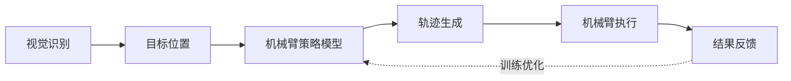
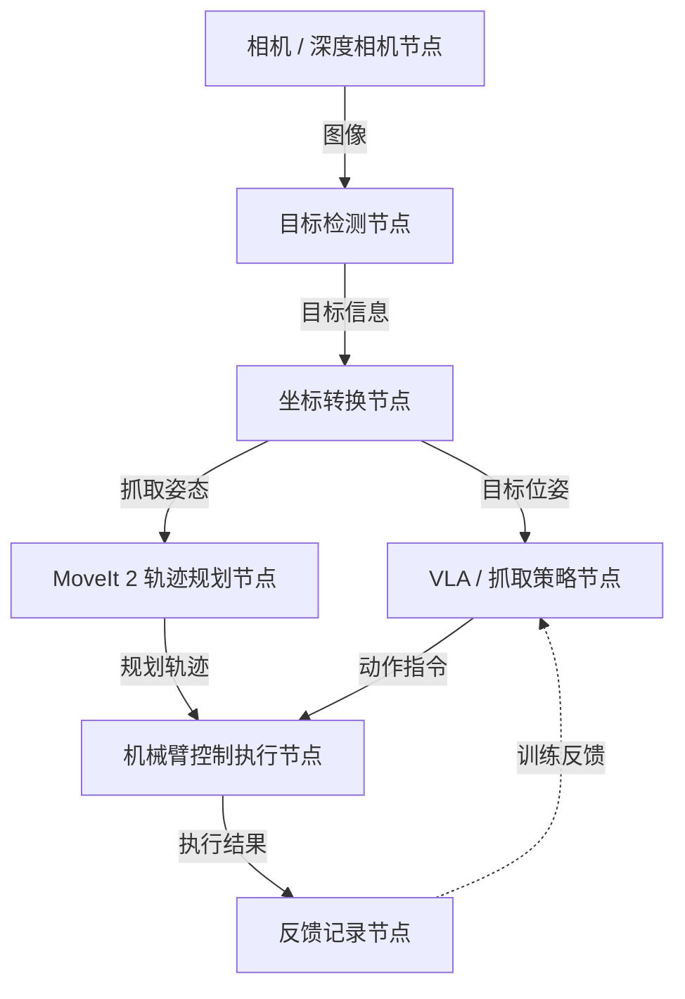
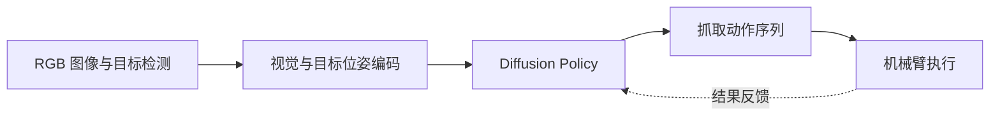

# 机械臂训练与学习模块实施方案

## 一、模块目标

机器人识别枯枝、垃圾等目标后，自主完成“识别 → 定位 → 抓取 → 放置”的闭环操作。

## 二、系统数据流



1. 语义识别模块输出目标类别与坐标。
2. VLA 或抓取策略模型根据目标信息生成动作。
3. 控制模块执行机械臂轨迹。
4. 成功/失败结果反馈用于模型优化。

## 三、核心实现步骤

1. 接收视觉模块输出的目标位置（ROS 2 Topic）。
2. 通过手眼标定将目标坐标转换到机械臂坐标系。
3. 输入策略模型生成抓取策略。
4. 使用策略直接输出动作，或通过 MoveIt 2 规划轨迹。
5. 执行接近、闭合夹爪和抬升动作。
6. 将物体放入指定区域。
7. 记录执行结果，用于后续训练优化。

## 四、抓取流程示例

```python
target = get_target_from_ros()
grasp_pose = transform_to_robot_frame(target)
action = model.predict(grasp_pose)
robot.move_to(action["position"])
robot.gripper.close()
```

## 五、ROS 2 系统架构



## 六、技术难点与创新点

1. **抓取鲁棒性**：不同形状、尺寸和材质会影响抓取成功率。
2. **视觉误差补偿**：需要结合深度信息、手眼标定或闭环控制降低定位偏差。
3. **多模态融合**：融合视觉、位置、语言任务与动作数据。
4. **模仿学习与强化学习结合**：先通过示教建立可靠基线，再考虑强化学习优化。
5. **场景泛化**：适应不同光照、背景、目标姿态和园林环境。

## 七、Diffusion Policy 的应用

### 可应用场景

- 生成平滑、鲁棒的机械臂抓取轨迹；
- 融合图像、目标位姿和动作信息；
- 对遮挡、形状差异和多种可行抓取动作建模；
- 提升复杂抓取场景的泛化能力。

### 实现方式

输入为目标图像、机器人状态和目标位姿，输出为机械臂动作序列。通过示教数据学习视觉与状态到动作的映射。

```python
action = torch.randn_like(action)

for t in reversed(range(T)):
    action = model.denoise(action, state, t)

robot.execute(action)
```

### Diffusion + VLA 结构



Diffusion Policy 可缓解传统行为克隆对噪声敏感、动作单一和复杂场景泛化不足等问题。当前项目应先用 LeRobot 的 ACT 或 Diffusion Policy 建立模仿学习基线，再逐步接入 ROS 2、目标检测、坐标转换和完整反馈闭环。
